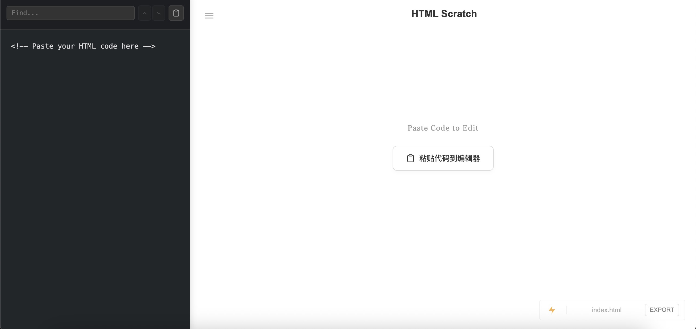

# English
# HTML Scratch

HTML Scratch is a lightweight tool for editing, previewing, and exporting HTML.  
It treats HTML as plain text and is designed for quickly writing, modifying, and validating HTML snippets.

The project is distributed as a single HTML file and can be used directly in a web browser.

No installation, no build step, and no backend service are required.

## Features

- Plain text HTML editing
- Live preview in an isolated iframe
- In-editor search and navigation
- Paste HTML directly from clipboard
- One-click export to `.html` files
- Collapsible and resizable editor panel
- Suitable as an HTML scratchpad or temporary workspace

All content is processed locally in the browser and never uploaded or persisted.

## Usage

Open the HTML file directly in a web browser.

Chromium-based browsers such as Chrome or Edge are recommended.

## Notes

- Editing and preview are fully handled on the front end
- Preview is rendered inside an iframe to isolate execution
- Runs entirely in the browser with no external services
- Does not modify or access original local files

## License

MIT

# Japanese
# HTML Scratch

HTML Scratch は、HTML を純粋なテキストとして編集・確認・書き出すための軽量ツールです。  
HTML スニペットを素早く記述・修正・検証する用途に適しています。

本プロジェクトは単一の HTML ファイルとして提供されており、  
ブラウザで直接開いて使用できます。

インストール不要、ビルド不要、バックエンド不要です。

## 機能

- プレーンテキストによる HTML 編集
- iframe を用いたリアルタイムプレビュー
- エディタ内検索およびナビゲーション
- クリップボードからの HTML 貼り付け
- `.html` ファイルとしてのワンクリック書き出し
- 折りたたみ・幅調整可能な編集パネル
- HTML 用のスクラッチパッド／一時作業スペースとして利用可能

すべての内容はブラウザ内でのみ処理され、  
外部に送信されたり永続化されることはありません。

## 使用方法

HTML ファイルをブラウザで直接開くだけで使用できます。

Chrome や Edge などの Chromium 系ブラウザを推奨します。

## 注意事項

- 編集およびプレビュー処理はすべてフロントエンドで行われます
- プレビューは iframe 内でレンダリングされ、メインページから分離されています
- 追加のサービスやサーバーを必要としません
- ローカルの元ファイルを変更・操作することはありません

## License

MIT

# Chinese
# HTML Scratch

HTML Scratch 是一个用于编辑、预览和导出 HTML 的轻量级工具。  
它将 HTML 作为纯文本处理，适合快速编写、修改和验证 HTML 片段。

项目以单个 HTML 文件形式存在，可直接在浏览器中打开使用。

无需安装、无需构建、无需后端服务。

## 功能

- 纯文本 HTML 编辑
- 实时预览（iframe 隔离）
- 编辑器内查找与跳转
- 从剪贴板粘贴 HTML
- 一键导出为 `.html` 文件
- 可折叠、可调整宽度的编辑区
- 适合作为 HTML 草稿区 / Scratchpad 使用

所有内容仅在浏览器本地处理，不会上传或持久化存储。

## 使用方式

直接用浏览器打开 HTML 文件即可。

建议使用 Chrome / Edge 等 Chromium 内核浏览器。

## 说明

- 编辑与预览完全在前端完成
- 预览通过 iframe 渲染，避免影响主页面
- 页面通过 CDN 或浏览器能力运行，无额外依赖
- 不会修改或访问任何本地原始文件

## License

MIT
